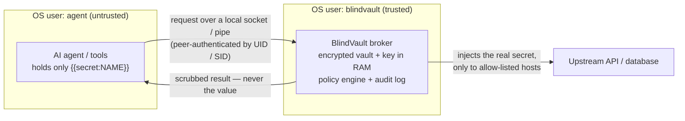

<div align="center">


# BlindVault

### A secrets vault your AI agents can use — but never read.

[](https://github.com/psypilot/blindvault/actions/workflows/ci.yml)
&nbsp;[](LICENSE)
&nbsp;[](https://www.python.org/)
&nbsp;[](CONTRIBUTING.md)

</div>

<br>

---

<br>

## 🧩 What is BlindVault?

AI agents leak secrets constantly — they print API keys into chat, paste them into
config files, and commit `.env` files. The root cause is simple: **the agent handles
the raw value at all.**

**BlindVault removes that.** Your agent works with **references** like
`{{secret:STRIPE_KEY}}`. It can list secrets and place them where they belong — but
the real value is substituted by a trusted broker at the last moment, and anything
that leaks back into output is scrubbed before the agent sees it.

> In one line: **the agent uses the secret without ever seeing it.**

<br>

---

<br>

## 📦 Install

Pick the one that fits you. **You do _not_ need a database, SSH, or anything else for
the core app** — see [_When do you need PostgreSQL or SSH?_](#-when-do-you-need-postgresql-or-ssh) below.

<br>

### Option A — Desktop app (easiest, no Python needed)

1. Download **`BlindVault.exe`** from the [**latest release**](https://github.com/psypilot/blindvault/releases/latest).
2. Double-click it.
3. On first launch it asks you to create a **master password** — done.

> Windows may show a SmartScreen warning (the binary is unsigned): **More info → Run anyway.**

<br>

### Option B — Command line (for your projects / automation)

Requires **Python 3.9+**.

```bash
pip install git+https://github.com/psypilot/blindvault.git
```

This gives you the **`bv`** command (and `blindvault`). Verify it:

```bash
bv --version
```

<br>

Full step-by-step instructions, platform notes, and optional add-ons are in
**[INSTALL.md](INSTALL.md)**. Hit a snag? **[TROUBLESHOOTING.md](TROUBLESHOOTING.md)**
walks through every common issue one by one.

<br>

---

<br>

## 🚀 Quickstart (60 seconds)

```bash
bv init                                    # create the vault + set a master password (once)

echo "sk_live_xxx" | bv set STRIPE_KEY --stdin --desc "prod payments"

bv ls                                      # see names + notes — never values

bv unlock                                  # type your password once; opens a short session

# Use a secret without ever seeing it — if it echoes back, it's scrubbed:
bv run -- curl -H "Authorization: Bearer {{secret:STRIPE_KEY}}" https://api.stripe.com/v1/charges
```

That's the whole idea. Point your AI agent at **[AGENTS.md](AGENTS.md)** and it will
follow these rules automatically.

<br>

---

<br>

## 🤔 When do you need PostgreSQL or SSH?

**Almost never — and never for the core app.** Most people use BlindVault for API
keys, tokens, and passwords, which need *nothing* extra.

<br>

| You want to… | Do you need anything extra? |
|---|---|
| Store & use API keys / tokens / passwords with an agent | **No.** Just install BlindVault. |
| Use the **desktop app** | **No.** The `.exe` is fully standalone. |
| Use the **Windows named-pipe broker** (`bv serve --pipe`) | `pip install "blindvault[windows]"` (adds `pywin32`). |
| Let an app reach **PostgreSQL** without the password (`bv serve --pg-listen`) | Only then — and you connect to a **Postgres you already run**. No Postgres? Spin one up for testing with a one-line Docker command (see [INSTALL.md](INSTALL.md#optional-a-postgres-to-test-the-connector)). |
| Use the **SSH** connector | Not yet — SSH is **planned** (see [ROADMAP.md](ROADMAP.md)). Nothing to install today. |

> **BlindVault never installs or bundles a database.** It is a *broker* to a database
> you run — like every other secrets manager.

<br>

---

<br>

## ✨ Features

- 🔑 **Reference, don't reveal** — agents use `{{secret:NAME}}`, never the value.
- 🔐 **Master-password lock** — encrypted with a key derived from your password and
  never stored on disk; the on-disk vault is just ciphertext.
- 🙈 **Agents can't print secrets** — `reveal` always requires the master password.
- 🚧 **Usage policies** — pin a secret to specific hosts/commands (`bv policy`).
- 🧱 **The resolver** — `bv serve` is a credential-injecting proxy where the value
  **never enters the agent**, with an OS-enforced boundary on **Linux & Windows**.
- 🐘 **PostgreSQL connector** — apps connect with no password; the broker does the
  `SCRAM-SHA-256`/`md5` handshake.
- 🖥️ **Desktop app**, `.env` import, audit log, and an honest threat model.

<br>

---

<br>

## 🗺️ How it works

The agent holds only **references**; the broker holds the real secret and is the only
thing that touches it. Run the broker as a **separate OS user** and the kernel itself
stops the agent from reading its memory, the key, or the vault.



Deep dive: **[docs/DESIGN-resolver.md](docs/DESIGN-resolver.md)**.

<br>

---

<br>

## 🔒 Security

BlindVault is honest about what it does and doesn't protect against — and we
**red-teamed our own tool** before asking anyone to trust it.

- The agent's normal workflow never puts plaintext in its context.
- With a master password, the vault is secure at rest and the agent can't read or
  print secrets.
- The resolver (separate-OS-user) is the real boundary; `bv run` scrubbing is
  defense-in-depth, not a sandbox.

Read the full **[threat model + red-team report](docs/SECURITY-redteam.md)** and how
to report issues in **[SECURITY.md](SECURITY.md)**.

<br>

---

<br>

## 📚 Documentation

| Doc | What's in it |
|---|---|
| [INSTALL.md](INSTALL.md) | Every install path, step by step, with platform notes |
| [TROUBLESHOOTING.md](TROUBLESHOOTING.md) | Common issues → cause → fix, one by one |
| [AGENTS.md](AGENTS.md) | Drop-in rules so an AI agent uses secrets safely |
| [docs/DESIGN-resolver.md](docs/DESIGN-resolver.md) | The resolver's full security design |
| [docs/DEPLOY-linux.md](docs/DEPLOY-linux.md) · [docs/DEPLOY-windows.md](docs/DEPLOY-windows.md) | Run the broker as a separate OS user |
| [docs/SECURITY-redteam.md](docs/SECURITY-redteam.md) | What our own attacks found |
| [ROADMAP.md](ROADMAP.md) | Planned work + good first issues |

<br>

---

<br>

## 🔎 Found this by searching?

BlindVault is an open-source **secrets manager for AI agents** — let LLM coding agents
(Claude, Cursor, Copilot, Aider, …) and pipelines **use API keys, database passwords,
and tokens without ever seeing the plaintext**. If you searched for: *stop AI/LLM
agents leaking API keys*, *prompt-injection secret exfiltration*, *secretless broker /
credential-injection proxy for AI agents*, *give an agent database access without the
password*, *a vault where the agent reads the name not the value* — you're in the
right place.

<br>

---

<br>

## 🤝 Contributing

Contributions are very welcome — see **[CONTRIBUTING.md](CONTRIBUTING.md)** for setup
and **[ROADMAP.md](ROADMAP.md)** for planned work and **good first issues**.

<br>

## 📄 License

MIT © Loizos Kallinos — see [LICENSE](LICENSE).
